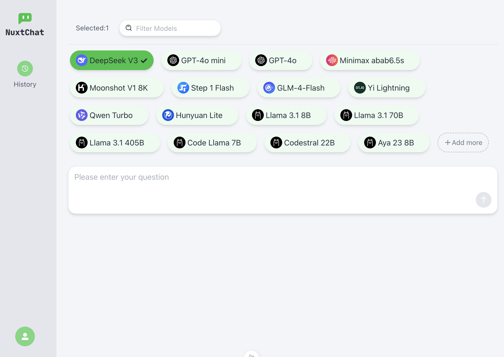
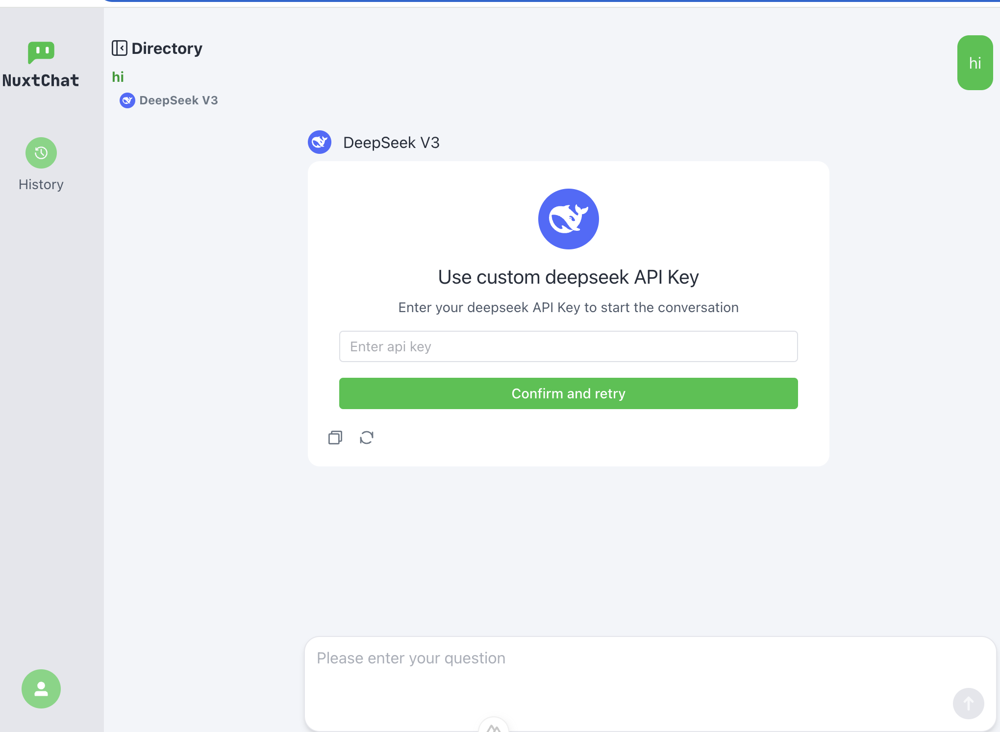

<h1 align="center">NuxtChat</h1>
Engage in conversations with multiple large language models simultaneously. Supports DeepSeek, OpenAI models, and local Ollama models. 

---
**English**  * [简体中文](./README.md) 

## Supported Models
[DeepSeek](https://platform.deepseek.com) / [OpenAI](https://platform.openai.com) / [Qwen](https://help.aliyun.com/zh/model-studio/getting-started/models) / [LingYi WanWu](https://platform.lingyiwanwu.com) / [Kimi](https://platform.moonshot.cn/) / [Minimax](https://platform.minimaxi.com) / [Doubao](https://console.volcengine.com/ark/region:ark+cn-beijing/openManagement?LLM=%7B%7D&OpenTokenDrawer=false) / [Zhipu](https://open.bigmodel.cn) / [Hunyuan](https://cloud.tencent.com/document/product/1729/104753) / [Stepfun](https://platform.stepfun.com) / [Ollama](https://ollama.com/download)

## Quick Start
1. Visit [nuxtchat.com](https://nuxtchat.com).
2. Prepare the API key for the model you wish to use, select the model to start a conversation, and configure the API key in the prompt interface to begin using it.

* The API keys for large models and chat data will be stored locally in your browser, and the model API requests will also be made directly from your local environment.

