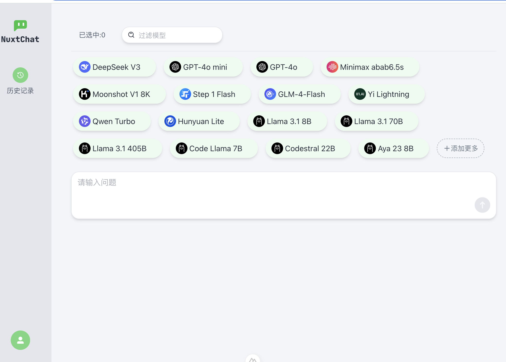
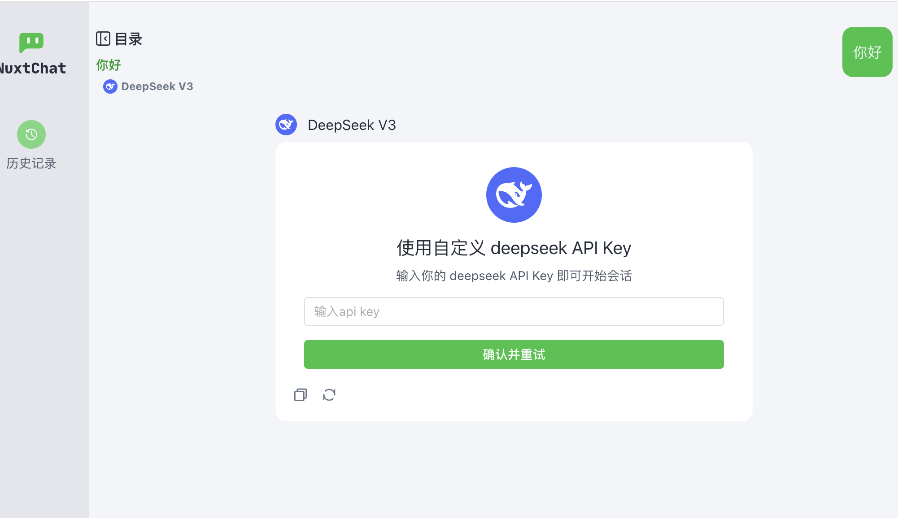

<h1 align="center">NuxtChat</h1>
一次选择多个大语言模型同时对话,支持DeepSeek、OpenAI等模型与ollama本地模型。

---
**简体中文**  * [English](./README.en.md) 

## 支持的模型
[DeepSeek](https://platform.deepseek.com) / [OpenAI](https://platform.openai.com)  / [千问](https://help.aliyun.com/zh/model-studio/getting-started/models) / [零一万物](https://platform.lingyiwanwu.com) / [Kimi](https://platform.moonshot.cn/) / [Minimax](https://platform.minimaxi.com) / [豆包](https://console.volcengine.com/ark/region:ark+cn-beijing/openManagement?LLM=%7B%7D&OpenTokenDrawer=false) / [智谱]( https://open.bigmodel.cn) /  [混元]( https://cloud.tencent.com/document/product/1729/104753) /  [阶跃星辰]( https://platform.stepfun.com) / [Ollama]( https://ollama.com/download)

## 直接使用
1. 直接访问地址[nuxtchat.com](https//nuxtchat.com).
2. 准备好你想使用模型的api key，勾选模型开始对话，在提示对话界面配置api key后即可使用。

* 大模型的api key与聊天数据将会保存在浏览器本地，模型的接口请求也会直接本地请求。

